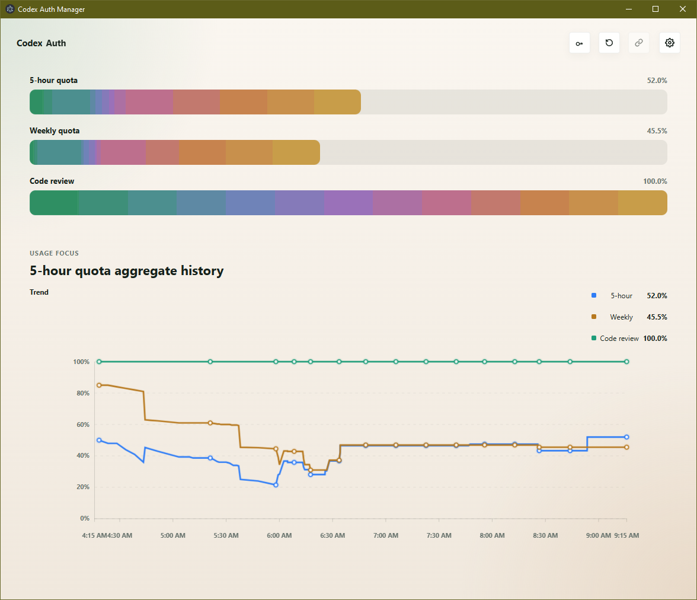

# Codex Auth Manager Public Releases

Codex Auth Manager is a Windows desktop tool for managing authentication across the Codex CLI and OpenCode environments from one place.

This public repository is used only for release assets.
It intentionally does not contain the private application source code.

## Software preview

## What the software does

- manage multiple imported auth accounts in one desktop app
- switch between Codex and OpenCode auth modes
- view account quota usage and refresh account state
- export or activate the account you want to use

## Switch to Chinese

1. Open the app.
2. Click the settings button in the top-right corner.
3. In the language row, click `zh-CN`.

The interface will switch from English to Chinese.

## Download

Download the latest Windows installer from the [Releases](../../releases) page.

Current public assets include:

- Windows installer (`.exe`)
- SHA256 checksum file

## Important notes

- this repository is release-only and kept intentionally minimal
- the app source code is maintained in a separate private repository
- current public builds may be unsigned, so Windows can show SmartScreen warnings before launch
- this page may include screenshots and product notes, but not the private implementation source

## Release scope

This repository may contain only safe public materials such as:

- release binaries
- checksums
- release notes
- basic product introduction
